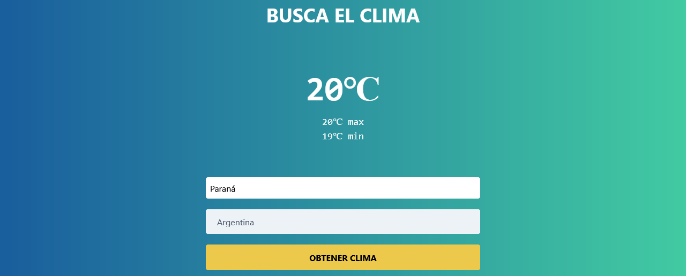

# Weather App ☁️

## Table of contents

- [Description](#description)
- [Screenshot](#screenshot)
- [Overview](#overview)
  - [Built with](#built-with)
  - [Code example](#code-example)
  - [Notes](#notes)
- [Links](#links)
- [Author](#author)

## Description

Single page application that shows weather from some locations.

## Screenshot 📸



## Overview

### Built with

Made with HTML, CSS, Tailwind and Javascript.
Async function for the Api fetch.

### Code Example

Worth to mention Js funtion "insertAdjacentHTML"

```js
formulario.insertAdjacentHTML(
  "beforeend",
  `<div class="mt-5 px-4 py-3 leading-normal text-red-700 bg-red-300 rounded-lg" role="alert"><p class="font-bold">${message}</p></div>`
);
```

### Notes 📝

Practicing fetch Api with Async function

## Links 🔗

[Live Demo](https://obtener-clima-fetch-api.vercel.app)

## Author 🧔

[Marcos Pennachini](https://www.linkedin.com/in/marcos-pennachini-b39898123/)
